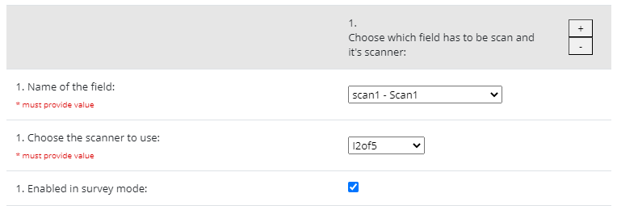

# Barcode-Scanner
This External Module allows barcodes to be scanned and have the decoded text returned into a text field.

It's using [QuaggaJS](https://github.com/serratus/quaggaJS)

QuaggaJS is a barcode-scanner entirely written in JavaScript supporting real- time localization and decoding of various types of barcodes such as EAN, CODE 128, CODE 39, EAN 8, UPC-A, UPC-C, I2of5, 2of5, CODE 93, CODE 32 and CODABAR.
The library is also capable of using getUserMedia to get direct access to the user’s camera stream.
Although the code relies on heavy image-processing even recent smartphones are capable of locating and decoding barcodes in real-time.

## Description
The module attaches a scan button next to selected text fields:

When the button is clicked, a small container will be displayed using your device's inbuild camera, which will decode the barcode you configured.

In addition, if your device is equipped with a flashlight, it will turn on to ensure decoding despite low light.
When the barcode has been detected, the container will hide and the field will be filled with the corresponding code.

## Configuration
In the configuration options, you can add as many fields as you want in as many different instruments. Each field can be configured with its own decoding technology.

Here is all the possible readers:

- code_128_reader
- ean_reader
- ean_8_reader
- code_39_reader
- code_39_vin_reader
- codabar_reader
- upc_reader
- upc_e_reader
- i2of5_reader
- 2of5_reader
- code_93_reader
- code_32_reader

## Browser Support

| Browser  | State |
| ------------- | ------------- |
| Edge  | Working  |
| Chrome  | Working  |
| Firefox  | Working  |
| IE 11  | **Not** Working  |
| Safari iOS  | Working  |
| Chrome iOS  | **Not** Working  |

## Limitations
Might have from times to times some false positive with poor printed barcode.
A good solution would be to implement the chesksum for each barcode technology.

## Idea for the future
- Add to the configuration options like zoom factor
- Add a on/off checkbox for flashlight
- Get Chrome iOS working
- Improve the resultCollector algo implemented
